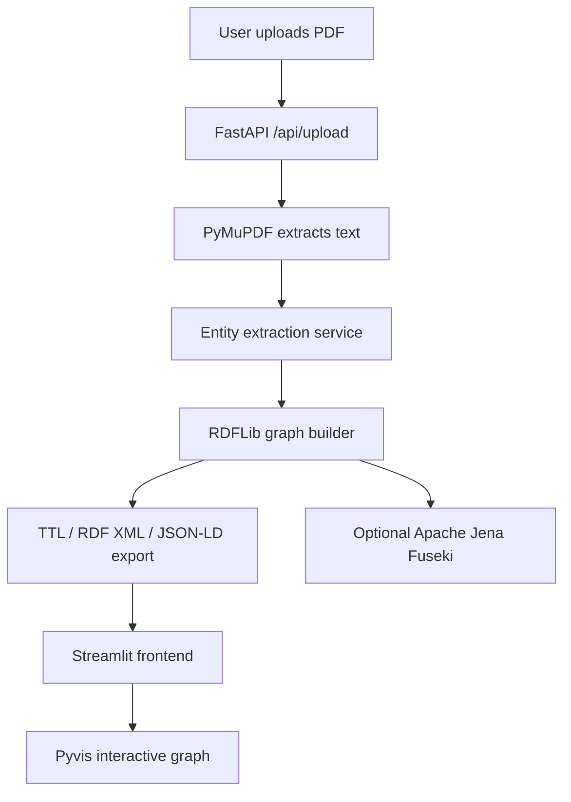

# Architecture

```mermaid
flowchart TD
    A[User uploads PDF] --> B[FastAPI /api/upload]
    B --> C[PyMuPDF extracts text]
    C --> D[Entity extraction service]
    D --> E[RDFLib graph builder]
    E --> F[TTL / RDF XML / JSON-LD export]
    E --> G[Optional Apache Jena Fuseki]
    F --> H[Streamlit frontend]
    H --> I[Pyvis interactive graph]
```
